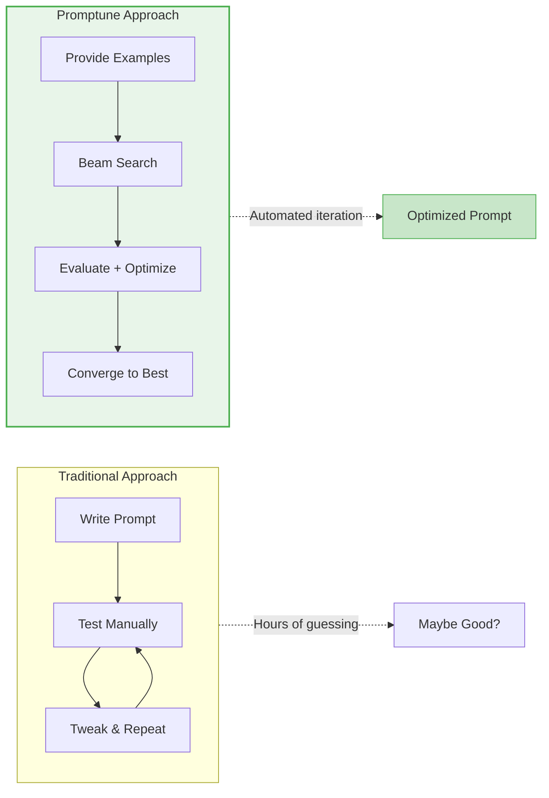
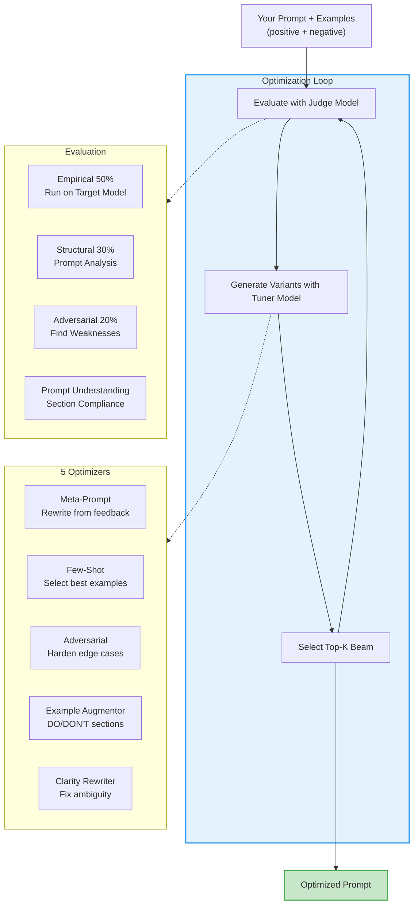

# Promptune

**Beam search prompt optimization for any LLM.**

Your prompt works on GPT-4 but breaks on Claude? Promptune finds what works for YOUR specific model.

## What Makes Promptune Different



**Key differentiators:**

- **Empirical testing** — Runs your prompt against real examples, compares output to expected
- **5 optimization strategies** — Meta-prompt rewriting, few-shot selection, adversarial hardening, example augmentation, clarity rewriting
- **Negative examples** — Teach what to AVOID with "bad output + reason why bad" pairs
- **Prompt understanding** — Analyzes which prompt sections the LLM follows vs ignores
- **3 model roles** — Separate target, tuner, and judge models for cost/quality control
- **LLM-agnostic** — Works with OpenAI, Azure, Anthropic, Ollama, or any LiteLLM model
- **Black-box support** — Optimize prompts for RAG pipelines, retrievers, or any custom system

## How It Works



## Quick Start

### 1. Create `promptune.yaml`

```yaml
models:
  target: "azure/gpt-4o-mini"    # Model the prompt runs on
  tuner: "azure/gpt-4o"          # Generates improved prompts
  judge: "azure/gpt-4o-mini"     # Scores outputs

optimization:
  beam_width: 3
  max_iterations: 10
  target_score: 0.90
  batch_size: 5
  optimizers:
    - meta_prompt
    - few_shot
    - adversarial
    - example_augmentor
    - clarity_rewriter
```

### 2. Create `.env` with your API keys

```bash
AZURE_OPENAI_API_KEY=your-key
AZURE_OPENAI_ENDPOINT=https://your-endpoint.openai.azure.com/
# Or: OPENAI_API_KEY=your-key
# Or: OLLAMA_API_BASE=http://localhost:11434
```

### 3. Run optimization

```bash
# With included datasets
python test_promptune.py --data datasets/code_assistant.json

# With custom config and data
python test_promptune.py --config myconfig.yaml --data my_examples.json

# Override settings via CLI
python test_promptune.py --data data.json --beam 5 --target 0.95 --batch-size 10

# Pick specific optimizers
python test_promptune.py --data data.json --optimizers meta_prompt adversarial

# Run until convergence
python test_promptune.py --data data.json --converge
```

### Python API

```python
import asyncio
from mcp_servers.beam_orchestrator.orchestrator import optimize_beam
from mcp_servers.utils.config import load_config
from mcp_servers.utils.data_loader import load_dataset

async def main():
    config = load_config("promptune.yaml")
    dataset = load_dataset("datasets/code_assistant.json")

    result = await optimize_beam(
        initial_prompt="You are a coding assistant.",
        training_examples=dataset.examples,
        negative_examples=dataset.negative_examples or None,
        config=config,
    )

    print(f"Score: {result.best_score:.0%}")
    print(f"Optimized Prompt:\n{result.best_prompt}")

asyncio.run(main())
```

## Training Data Format

### Positive examples (JSON)

```json
[
  {"input": "Write hello world", "expected_output": "print('Hello, World!')"},
  {"input": "Add two numbers", "expected_output": "def add(a, b): return a + b"}
]
```

### With negative examples (same file)

```json
[
  {"input": "Write hello world", "expected_output": "print('Hello, World!')"},
  {
    "sample_prompt": "You are a code assistant.",
    "input": "Write hello world",
    "bad_output": "Hello World",
    "reason_why_bad": "Not valid Python code, just plain text"
  }
]
```

CSV format is also supported with the same column names.

## Included Datasets

| Dataset | Examples | Negatives | Use Case |
|---------|----------|-----------|----------|
| `code_assistant.json` | 51 | 0 | Python code generation |
| `text_summarizer.json` | 51 | 0 | News/text summarization |
| `sentiment_classifier.json` | 52 | 0 | Sentiment analysis (pos/neg/neutral) |
| `email_writer_with_negatives.json` | 25 | 21 | Professional email writing |
| `math_tutor.json` | 52 | 0 | Math problem solving |

## Custom Evaluation Targets

Optimize prompts for any black-box system, not just LLMs:

```python
from mcp_servers.targets.base import BaseTarget

class MyRAGPipeline(BaseTarget):
    async def invoke(self, prompt: str, input_text: str) -> str:
        rewritten_query = await self.rewrite(prompt, input_text)
        documents = await self.retrieve(rewritten_query)
        return self.format_response(documents)

result = await optimize_beam(
    initial_prompt="Rewrite queries for better retrieval.",
    training_examples=examples,
    target=MyRAGPipeline(),
)
```

## The 5 Optimizers

| Optimizer | What It Does |
|-----------|-------------|
| **meta_prompt** | Rewrites the prompt based on evaluation feedback and prompt understanding analysis |
| **few_shot** | Selects and formats the best few-shot examples using relevance, diversity, and complexity scoring |
| **adversarial** | Generates edge-case inputs that break the prompt, then hardens it against those failures |
| **example_augmentor** | Injects DO/DON'T sections using positive and negative training examples |
| **clarity_rewriter** | Identifies ambiguous instructions and rewrites them for precision |

## Architecture

```
promptune/
├── promptune.yaml                # Config: models + optimization params
├── .env                          # API keys
├── datasets/                     # Training datasets (JSON/CSV)
├── mcp_servers/
│   ├── evaluator/                # 3-part scoring + prompt understanding
│   ├── meta_prompt_optimizer/    # Feedback-driven rewriting
│   ├── few_shot_optimizer/       # Example selection & formatting
│   ├── adversarial_optimizer/    # Edge-case hardening
│   ├── example_augmentor/        # DO/DON'T injection
│   ├── clarity_rewriter/         # Ambiguity resolution
│   ├── beam_orchestrator/        # Beam search coordination
│   ├── targets/                  # Custom evaluation targets
│   └── utils/
│       ├── config.py             # YAML config system
│       ├── llm.py                # Structured LLM calls (Pydantic)
│       ├── data_loader.py        # Auto-infer JSON/CSV loader
│       └── logger.py             # Component-aware logging
├── schemas/                      # Shared Pydantic models
└── tests/                        # Unit + integration tests
```

## Installation

```bash
pip install -e ".[dev]"
```

## Development

```bash
# Run tests
pytest -v

# Lint
ruff check .
```

## License

MIT
