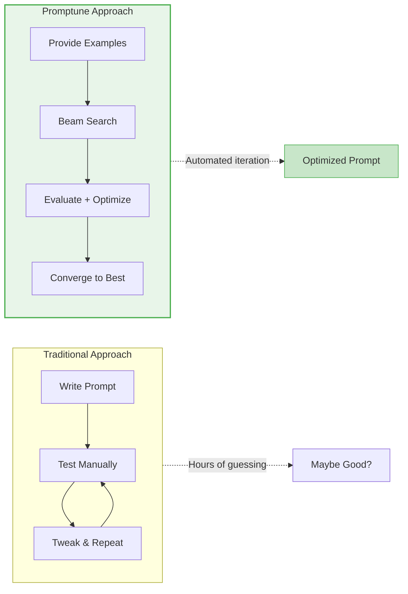
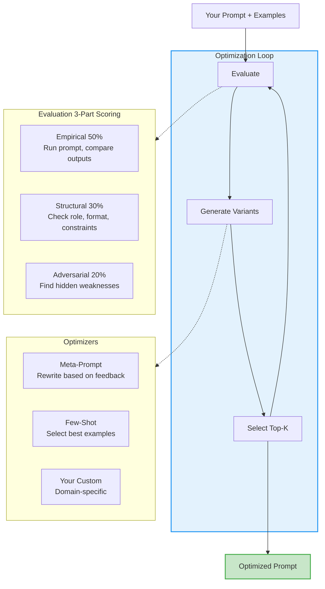

# Promptune

**Beam search prompt optimization for any LLM.**

Your prompt works on GPT-4 but breaks on Claude? Promptune finds what works for YOUR specific model.

## What Makes Promptune Different



**Key differentiators:**

- **Empirical testing** - Actually runs your prompt, compares output to expected
- **Multi-strategy optimization** - Meta-prompt rewriting + few-shot selection
- **LLM-agnostic** - Works with OpenAI, Azure, Anthropic, Ollama, or any LiteLLM model
- **Extensible** - Add your own domain-specific optimizers
- **Black-box support** - Optimize prompts for RAG pipelines, retrievers, or any custom system

## How It Works



## Quick Start

```python
import asyncio
from mcp_servers.beam_orchestrator.orchestrator import BeamConfig, optimize_beam
from schemas import TrainingExample

async def main():
    # Define what good output looks like
    examples = [
        TrainingExample(
            input="Write hello world in Python",
            expected_output="print('Hello, World!')",
        ),
        TrainingExample(
            input="Write a function to add two numbers",
            expected_output="def add(a, b):\n    return a + b",
        ),
    ]

    # Configure optimization
    config = BeamConfig(
        beam_width=3,           # Keep top 3 candidates per iteration
        max_iterations=10,      # Max optimization rounds
        target_score=0.90,      # Stop when 90% score reached
        optimizers=["meta_prompt", "few_shot"],
    )

    # Run optimization
    result = await optimize_beam(
        initial_prompt="You are a coding assistant.",
        training_examples=examples,
        config=config,
    )

    print(f"Score: {result.best_score:.0%}")
    print(f"Optimized Prompt:\n{result.best_prompt}")

asyncio.run(main())
```

## Custom Evaluation Targets

Optimize prompts for any black-box system, not just LLMs:

```python
from mcp_servers.targets.base import BaseTarget

class MyRAGPipeline(BaseTarget):
    """Optimize prompts for your retrieval system."""
    
    async def invoke(self, prompt: str, input_text: str) -> str:
        # Your custom logic here
        rewritten_query = await self.rewrite(prompt, input_text)
        documents = await self.retrieve(rewritten_query)
        return self.format_response(documents)

# Use it
result = await optimize_beam(
    initial_prompt="Rewrite queries for better retrieval.",
    training_examples=examples,
    target=MyRAGPipeline(),  # Your custom target
)
```

## Add Your Own Optimizer

Create domain-specific optimizers for specialized prompting techniques:

```python
# mcp_servers/my_optimizer/optimizer.py
async def optimize(prompt: str, feedback: dict, **kwargs) -> OptimizationResult:
    # Your domain-specific optimization logic
    # e.g., chain-of-thought injection, legal document formatting, etc.
    ...
```

Then add it to the config:

```python
config = BeamConfig(
    optimizers=["meta_prompt", "few_shot", "my_optimizer"],
)
```

## CLI Usage

```bash
# Basic optimization
python test_promptune.py --prompt "You are a helpful assistant."

# Run until convergence
python test_promptune.py --converge

# Custom target score
python test_promptune.py --target 0.95

# Minimal output
python test_promptune.py --quiet
```

## Architecture

Promptune uses a **Skills + MCP** architecture:

- **Skills** (Markdown): Define WHEN and HOW to use each capability
- **MCP Servers** (Python): Provide executable tools

```
promptune/
├── skills/                    # Skill definitions (markdown)
│   ├── evaluator/
│   ├── meta_prompt_optimizer/
│   ├── few_shot_optimizer/
│   └── beam_orchestrator/
├── mcp_servers/               # MCP server implementations
│   ├── evaluator/
│   ├── meta_prompt_optimizer/
│   ├── few_shot_optimizer/
│   ├── beam_orchestrator/
│   └── targets/               # Custom target support
├── schemas/                   # Shared data models
└── tests/                     # Test suite
```

## Installation

```bash
pip install -e ".[dev]"
```

## Configuration

Set your LLM credentials in `.env`:

```bash
# Azure OpenAI
AZURE_OPENAI_ENDPOINT=https://your-endpoint.openai.azure.com/
AZURE_OPENAI_API_KEY=your-key
AZURE_OPENAI_API_VERSION=2024-02-15-preview
AZURE_OPENAI_MODEL=gpt-4o-mini

# Or Ollama (local)
OLLAMA_API_BASE=http://localhost:11434
```

## Development

```bash
# Run tests
pytest

```

## License

MIT
